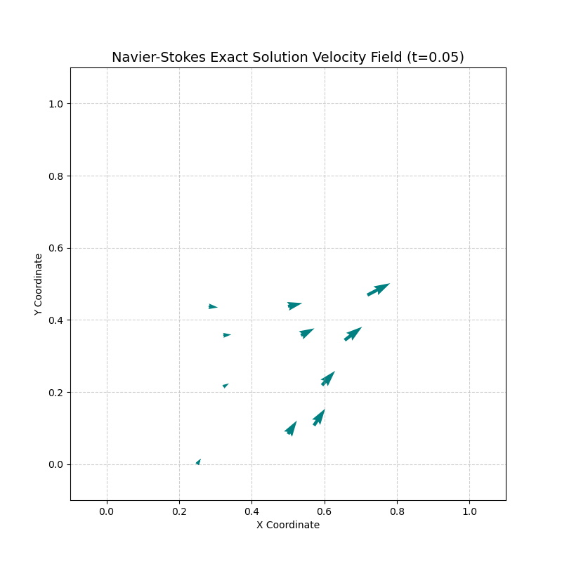

# MA 402 Final Project: Translation and Documentation of PETSc 

This repository contains the final project for MA 402. The objective of this project is to translate a highly optimized PETSc C example `ex46.c` to a fully functional Python implementation using `petsc4py`. This example is for a Navier-Stokes solver, which uses the time-dependent incompressible Navier-Stoked equation to solve for the flow of an incompressible fluid at low to moderate Reynolds number.

### From original code:

"Time dependent Navier-Stokes problem in 2d and 3d with finite elements. We solve the Navier-Stokes in a rectangular domain, using a parallel unstructured mesh (DMPLEX) to discretize it. This example supports discretized auxiliary fields (Re) as well as multilevel nonlinear solvers."

## Notes on AI Translation

Initial conversion of the PETSc C code to Python was done using Google Gemini, which initially produced frustrating and inoperable results. Switching to Gemini's Pro model proved effective, and the code it supplied, with a handful of bug fixes, streamlined the solving process with workarounds in Python.

Through several attempts, a functioning Python script was not able to be generated by Gemini without needed several debugging steps. This speaks to the power of artificial intelligence models to replicate code and assist in the conversion progress, but indicates the significant role of human debugging that remains essential to the refinement and production of working converted models.

## Repository Structure

`tutorial_module.py`: The core Python module containing the NavierStokesSolver class. It manages the mesh generation, discretization, and global physics assembly.

`docs/`: The folder of markdown files detailing the source code archaeology for three essential `petsc4py` functions used in `tutorial_module.py`. It explains the discrepancies between C and Python functions.

`tutorial_presentation.ipynb`: A Jupyter Notebook demonstrating how to import the solver, run the simulation, and visualize the resulting velocity vector fields using Matplotlib.

## Prerequisites & Installation

This code is most effectively run using Anaconda, and requires several packages to be installed using the following terminal command:

```
conda install -c conda-forge petsc4py mpi4py numpy matplotlib
```

## Running with Jupyter Notebook

To visualize the velocity field:

1. Open your Jupyter Notebook environment.

2. Ensure the kernel is set to the environment containing petsc4py.

3. Run the cells importing tutorial_module.py.

4. Run the cells that plot the results. The notebook extracts the topological node data and renders the $2D$ flow using matplotlib.pyplot.quiver.

## Example Output

Below is an example plot resulting from running the code in a Jupyter notebook:



## Documentation Notes

For an in-depth look at how specific PETSc C functions were mapped to Python--including workarounds for `PETSc.FE().createDefault`, `PETSc.TS().create()`, and `PETSc.DMPlex.createBoxMesh()`--please refer to the markdown files in `docs/`.

## PETSc.TS().create()

### [petsc4py Reference](https://petsc.org/main/petsc4py/reference/petsc4py.PETSc.TS.html#petsc4py.PETSc.TS.create)

create(comm=None)
Create an empty TS.

Collective.

The problem type can then be set with setProblemType and the type of solver can then be set with setType.

Parameters
:
comm (Comm | None) – MPI communicator, defaults to Sys.getDefaultComm.
Return type
:
Self
See also
TSCreate
Source code at petsc4py/PETSc/TS.pyx:220

### [petsc4py Documentation](https://github.com/erdc/petsc4py/blob/master/src/PETSc/DMPlex.pyx)

    def create(self, comm=None):
        cdef MPI_Comm ccomm = def_Comm(comm, PETSC_COMM_DEFAULT)
        cdef PetscTS newts = NULL
        CHKERR( TSCreate(ccomm, &newts) )
        PetscCLEAR(self.obj); self.ts = newts
        return self

### [C Source (GitLab)](https://petsc.org/main/manualpages/TS/TSCreate/)

## PETSc.FE().createDefault()

### [petsc4py Reference](https://petsc.org/main/petsc4py/reference/petsc4py.PETSc.FE.html#petsc4py.PETSc.FE.createDefault)

createDefault(dim, nc, isSimplex, qorder=DETERMINE, prefix=None, comm=None)
Create a FE for basic FEM computation.

Collective.

Parameters
:
dim (int) – The spatial dimension.
nc (int) – The number of components.
isSimplex (bool) – Flag for simplex reference cell, otherwise it’s a tensor product.
qorder (int) – The quadrature order or DETERMINE to use Space polynomial degree.
prefix (str | None) – The options prefix, or None.
comm (Comm | None) – MPI communicator, defaults to Sys.getDefaultComm.
Return type
:
Self
See also
PetscFECreateDefault
Source code at petsc4py/PETSc/FE.pyx:76

## PETSc.DMPlex().createBoxMesh()

### [petsc4py Reference](https://petsc.org/main/petsc4py/reference/petsc4py.PETSc.DMPlex.html#petsc4py.PETSc.DMPlex.createBoxMesh)

createBoxMesh(faces, lower=(0, 0, 0), upper=(1, 1, 1), simplex=True, periodic=False, interpolate=True, localizationHeight=0, sparseLocalize=True, comm=None)
Create a mesh on the tensor product of intervals.

Collective.

Parameters
:
faces (Sequence[int]) – Number of faces per dimension, or None for the default.
lower (Sequence[float] | None) – The lower left corner.
upper (Sequence[float] | None) – The upper right corner.
simplex (bool | None) – True for simplices, False for tensor cells.
periodic (Sequence | str | int | bool | None) – The boundary type for the X, Y, Z direction, or None for DM.BoundaryType.NONE.
interpolate (bool | None) – Flag to create intermediate mesh entities (edges, faces).
localizationHeight (int | None) – Flag to localize edges and faces in addition to cells; only significant for periodic meshes.
sparseLocalize (bool | None) – Flag to localize coordinates only for cells near the periodic boundary; only significant for periodic meshes.
comm (Comm | None) – MPI communicator, defaults to Sys.getDefaultComm.
Return type
:
Self
See also
DM, DMPlex, DM.setFromOptions, DMPlex.createFromFile, DM.setType, DM.create, DMPlexCreateBoxMesh
Source code at petsc4py/PETSc/DMPlex.pyx:90

### [petsc4py Documentation](https://github.com/erdc/petsc4py/blob/master/src/PETSc/TS.pyx)

*-no createBoxMesh, used create

    def create(self, comm=None):
        cdef MPI_Comm ccomm = def_Comm(comm, PETSC_COMM_DEFAULT)
        cdef PetscDM newdm = NULL
        CHKERR( DMPlexCreate(ccomm, &newdm) )
        PetscCLEAR(self.obj); self.dm = newdm
        return self